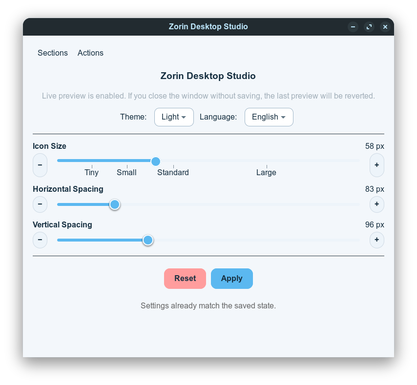

# Zorin Desktop Studio

[](https://github.com/aliafacan/zorin-desktop-studio/releases)
[](https://github.com/aliafacan/zorin-desktop-studio/actions/workflows/release.yml)

GTK desktop utility for Zorin OS to tune icon layout and edit `.desktop` launchers.

Languages:

- English (this file)
- Turkish: [README.tr.md](README.tr.md)

The app has two main sections:

- Icon Settings with live preview (size, horizontal spacing, vertical spacing)
- Desktop Launchers editor for existing `.desktop` files on desktop

Key features:

- Live preview while moving sliders
- `Apply` to persist and `Reset` to return to defaults
- In-app admin password prompt for privileged operations
- Turkish and English interface
- Light and dark theme support
- Edit display name, file name, icon, exec command and comment in `.desktop` launchers

## Screenshot



## Download

- Latest release: https://github.com/aliafacan/zorin-desktop-studio/releases/latest
- Direct `.deb` (v1.0.0): https://github.com/aliafacan/zorin-desktop-studio/releases/download/v1.0.0/zorin-icon-settings_1.0.0_all.deb

## Requirements

- Python 3.10+
- `python3-gi`
- `gir1.2-gtk-3.0`
- Zorin OS / GNOME Desktop Icons uzantısı

Optional for development in virtual environments:

- `PyGObject`
- `PyGObject-stubs`

## Run

```bash
python3 main.py
```

or

```bash
./zorin-icon-settings.py
```

## Build Debian Package

From project directory:

```bash
chmod +x build_deb.sh
./build_deb.sh
```

The output package is generated in `dist/`.

Install:

```bash
sudo dpkg -i dist/zorin-icon-settings_1.0.0_all.deb
sudo apt-get install -f
```

## Release Automation

Tag-based GitHub release workflow is configured:

```bash
git tag v1.0.0
git push origin v1.0.0
```

This triggers `.github/workflows/release.yml`, builds `.deb`, and uploads it to GitHub Releases.

## Privacy Note

No hard-coded private key, token, or API secret is stored in the source.

Admin password is kept only in memory during app runtime and is not written to disk.
