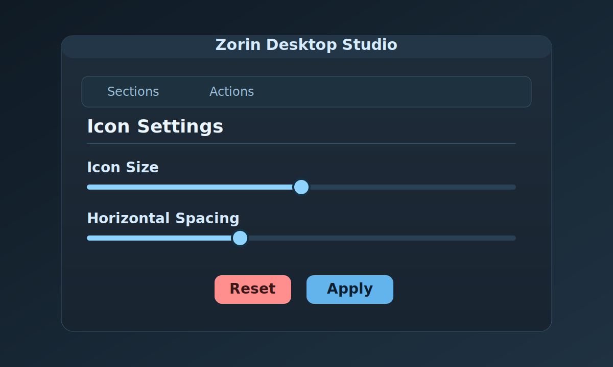

# Zorin Desktop Studio

[](https://github.com/aliafacan/zorin-desktop-studio/releases)
[](https://github.com/aliafacan/zorin-desktop-studio/actions/workflows/release.yml)

Zorin OS masaüstü ikonları için GTK tabanlı ayar ve düzenleme aracı.

Uygulama iki ana bölüm içerir:

- Simge boyutu ve aralıkları için canlı önizlemeli ayar ekranı
- Masaüstündeki `.desktop` kısayollarını düzenleme ekranı

Öne çıkanlar:

- Canlı önizleme ile simge boyutu, yatay aralık ve dikey aralık ayarı
- `Uygula` ile kalıcı kaydetme, `Sıfırla` ile varsayılan değerlere dönme
- Uygulama içinden yönetici parolası isteme
- Türkçe ve İngilizce arayüz
- Açık ve koyu tema desteği
- Masaüstündeki `.desktop` dosyalarının ad, dosya adı, simge, komut ve açıklama alanlarını düzenleme

## Ekran Görüntüsü



## İndir

- Son sürüm: https://github.com/aliafacan/zorin-desktop-studio/releases/latest
- Doğrudan `.deb` (v1.0.0): https://github.com/aliafacan/zorin-desktop-studio/releases/download/v1.0.0/zorin-icon-settings_1.0.0_all.deb

## Gereksinimler

- Python 3.10+
- `python3-gi`
- `gir1.2-gtk-3.0`
- Zorin OS / GNOME Desktop Icons uzantısı

Geliştirme ortamında ek olarak sanal ortama şu paketler kurulabilir:

- `PyGObject`
- `PyGObject-stubs`

## Çalıştırma

```bash
python3 main.py
```

veya

```bash
./zorin-icon-settings.py
```

## Debian Paketi Oluşturma

Proje dizininde:

```bash
chmod +x build_deb.sh
./build_deb.sh
```

Başarılı olursa çıktı dosyası `dist/` altında oluşur.

Kurulum:

```bash
sudo dpkg -i dist/zorin-icon-settings_1.0.0_all.deb
sudo apt-get install -f
```

## GitHub İçin Önerilen Adımlar

Bu klasörü bağımsız bir depo olarak paylaşmak için:

```bash
cd icon_settings
git init
git add .
git commit -m "Initial release"
```

Sonra GitHub üzerinde public bir repo açıp uzak depo ekleyebilirsin:

```bash
git remote add origin <REPO_URL>
git branch -M main
git push -u origin main
```

Sürüm etiketi ile otomatik release çıkarmak için:

```bash
git tag v1.0.0
git push origin v1.0.0
```

## Gizlilik Notu

Kod içinde kalıcı olarak saklanan bir parola, token veya özel anahtar bulunmuyor.

Yönetici parolası yalnızca uygulama açıkken bellekte tutulur ve dosyaya yazılmaz.
