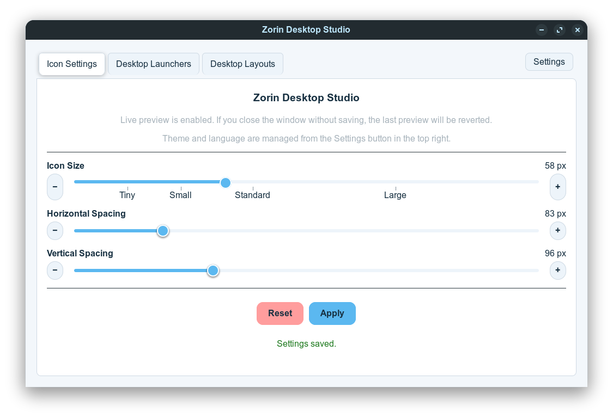
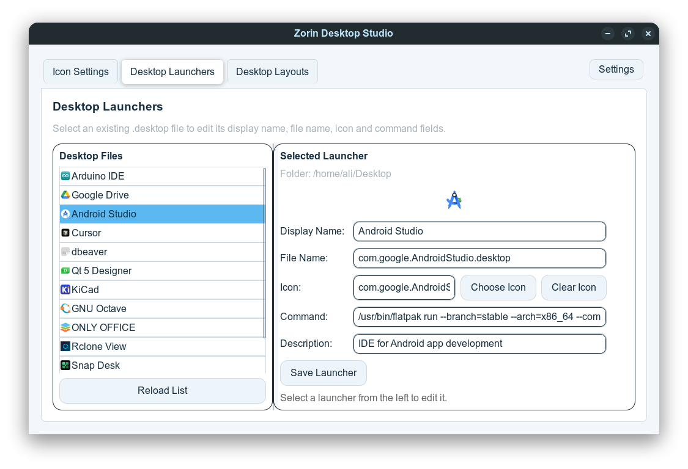
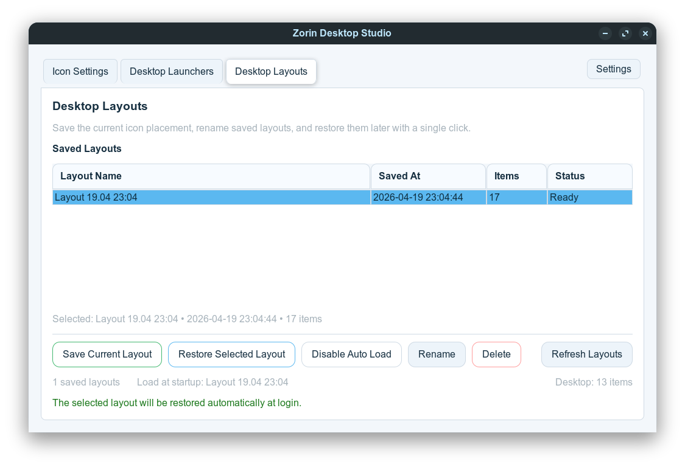

# Zorin Desktop Studio

[](https://github.com/aliafacan/zorin-desktop-studio/releases)
[](https://github.com/aliafacan/zorin-desktop-studio/actions/workflows/release.yml)

Zorin OS masaüstü ikonları için GTK tabanlı ayar ve düzenleme aracı.

Diller:

- Türkçe (bu dosya)
- İngilizce: [README.md](README.md)

Uygulama üç ana bölüm içerir:

- Simge boyutu ve aralıkları için canlı önizlemeli ayar ekranı
- Masaüstündeki `.desktop` kısayollarını düzenleme ekranı
- Masaüstü ikon yerleşimlerini kaydetme ve geri yükleme ekranı

Öne çıkanlar:

- Canlı önizleme ile simge boyutu, yatay aralık ve dikey aralık ayarı
- `Uygula` ile kalıcı kaydetme, `Sıfırla` ile varsayılan değerlere dönme
- Uygulama içinden yönetici parolası isteme
- Türkçe ve İngilizce arayüz
- Açık ve koyu tema desteği
- Masaüstündeki `.desktop` dosyalarının ad, dosya adı, simge, komut ve açıklama alanlarını düzenleme
- Kaydedilmiş düzenleri yeniden adlandırma, geri yükleme ve silme
- **Masaüstü İzleyici**: masaüstü dizinini arka planda izler; dosya eklendiğinde, silindiğinde veya yeniden adlandırıldığında seçili düzeni otomatik olarak yeniden uygular — sistem olaylarından sonra simge konumlarının kaybolmasını engeller

## Ekran Görüntüleri

### Simge Ayarları



### Masaüstü Kısayolları



### Masaüstü Düzenleri



## İndir

- Son sürüm: https://github.com/aliafacan/zorin-desktop-studio/releases/latest
- Doğrudan `.deb` (v2.1.0): https://github.com/aliafacan/zorin-desktop-studio/releases/download/v2.1.0/zorin-icon-settings_2.1.0_all.deb

## Gereksinimler

- Python 3.10+
- `python3-gi`
- `gir1.2-gtk-3.0`
- Zorin OS / GNOME Desktop Icons uzantısı

Geliştirme ortamında ek olarak sanal ortama şu paketler kurulabilir:

- `PyGObject`
- `PyGObject-stubs`

## Çalıştırma

```bash
python3 main.py
```

veya

```bash
./zorin-icon-settings.py
```

## Debian Paketi Oluşturma

Proje dizininde:

```bash
chmod +x build_deb.sh
./build_deb.sh
```

Başarılı olursa çıktı dosyası `dist/` altında oluşur.

Kurulum:

```bash
sudo dpkg -i dist/zorin-icon-settings_2.1.0_all.deb
sudo apt-get install -f
```

## Flatpak / Flathub Hazırlığı

Flathub uyumlu paketleme dosyaları [packaging/flatpak](packaging/flatpak) altında yer alır:

- [packaging/flatpak/com.github.aliafacan.ZorinDesktopStudio.json](packaging/flatpak/com.github.aliafacan.ZorinDesktopStudio.json)
- [packaging/flatpak/com.github.aliafacan.ZorinDesktopStudio.desktop](packaging/flatpak/com.github.aliafacan.ZorinDesktopStudio.desktop)
- [packaging/flatpak/com.github.aliafacan.ZorinDesktopStudio.metainfo.xml](packaging/flatpak/com.github.aliafacan.ZorinDesktopStudio.metainfo.xml)

Yerelde Flatpak derleme testi için:

```bash
chmod +x packaging/flatpak/build_flatpak_local.sh
./packaging/flatpak/build_flatpak_local.sh
```

## Release Otomasyonu

Etiket (tag) ile otomatik release oluşturma ayarlı:

```bash
git tag v2.1.0
git push origin v2.1.0
```

Bu işlem `.github/workflows/release.yml` workflow’unu tetikler, `.deb` paketini üretir ve GitHub Releases bölümüne yükler.

## Gizlilik Notu

Kod içinde kalıcı olarak saklanan bir parola, token veya özel anahtar bulunmuyor.

Yönetici parolası yalnızca uygulama açıkken bellekte tutulur ve dosyaya yazılmaz.
